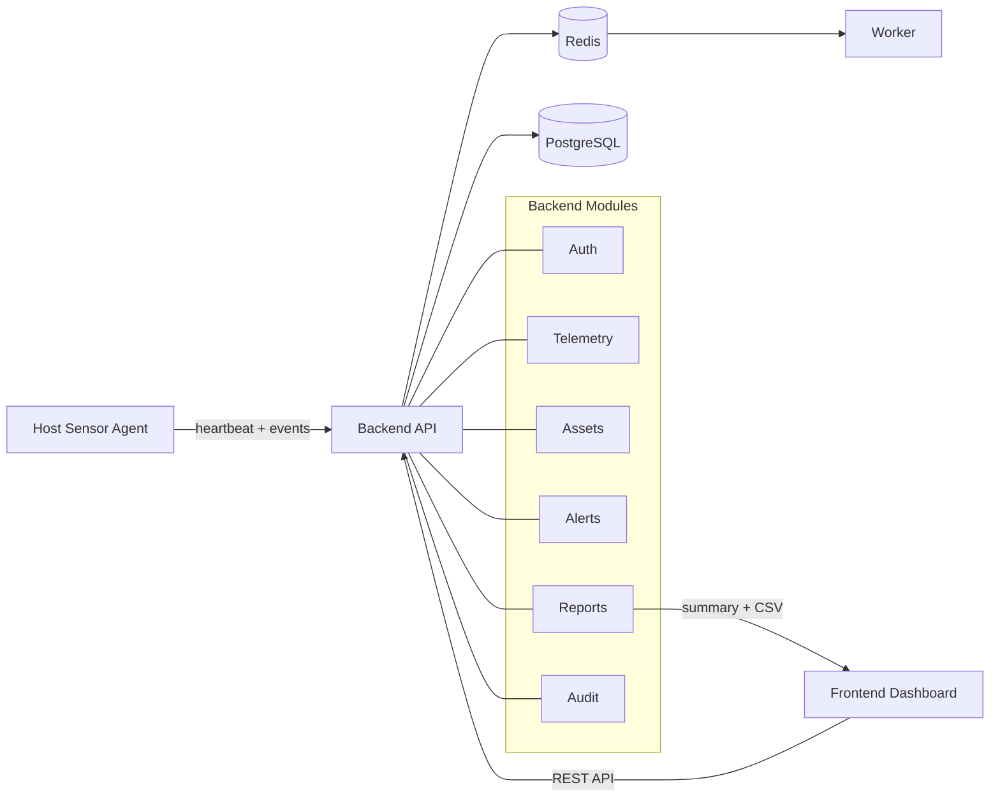

# DevinciWatch

DevinciWatch est un projet de cybersurveillance réseau orienté SOC. Il vise à concevoir une solution démontrable capable d'observer un environnement réseau, de qualifier des événements de sécurité, de produire des alertes actionnables et de fournir des preuves exploitables pour l'analyse et la soutenance.

Le projet vise à couvrir les besoins suivants :

- collecte de télémétrie depuis un endpoint supervisé ;
- persistance des événements et inventaire d'actifs ;
- détection par règles simples et création d'alertes actionnables ;
- corrélation de signaux répétés ou liés à une même source ;
- triage analyste via une interface web ;
- reporting, KPI et exports CSV / JSON.

Le projet est structuré pour répondre à une exigence universitaire : relier clairement le besoin initial, les études stratégiques, le cadrage fonctionnel, la gestion de projet, le cahier des charges et l'architecture technique.

## Schéma global de fonctionnement

## Flux métier simplifié

1. L'agent envoie des `heartbeat` et des `events` vers l'API.
2. L'API persiste la télémétrie en base.
3. Les événements mettent à jour ou créent des actifs.
4. Les règles de détection créent des alertes actionnables.
5. L'analyste consulte et traite les alertes depuis l'interface web.
6. Le module de reporting expose des KPI et des exports CSV.
7. Le module d'audit journalise les actions sensibles.

## Présentation du projet

- **Auth** : authentification et contrôle d'accès.
- **Telemetry** : ingestion et consultation des événements.
- **Assets** : inventaire enrichi depuis les événements observés.
- **Alerts** : liste, détail et traitement des alertes.
- **Reports** : synthèse et exports.
- **RBAC** : protection des actions sensibles selon le rôle.
- **Audit Trail** : traçabilité des actions critiques.

## Structure du dépôt

- [`product/`](product/) : futur code source du produit DevinciWatch.
- [`website/`](website/) : futur site web officiel [devinciwatch.com](https://devinciwatch.com).
- [`documents/`](documents/) : livrables pédagogiques, stratégiques, fonctionnels et techniques.

## Navigation rapide

- Produit : [product/README.md](product/README.md)
- Site web : [website/README.md](website/README.md)
- Documents : [documents/README.md](documents/README.md)
- Étude de marché : [documents/02_etude_de_marche/rendu_principal.md](documents/02_etude_de_marche/rendu_principal.md)
- Business model : [documents/03_business_model/rendu_principal.md](documents/03_business_model/rendu_principal.md)
- Business plan : [documents/04_business_plan/rendu_principal.md](documents/04_business_plan/rendu_principal.md)
- Architecture retenue : [documents/08_architecture/rendu_principal.md](documents/08_architecture/rendu_principal.md)

## Documentation associée

- Documents pédagogiques : [documents/01_documents_pedagogiques/README.md](documents/01_documents_pedagogiques/README.md)
- Références transverses : [documents/90_references_transverses/README.md](documents/90_references_transverses/README.md)

## État actuel

La branche `main` est organisée pour séparer clairement :

- le futur produit,
- le futur site corporate,
- les livrables académiques et stratégiques déjà consolidés.
