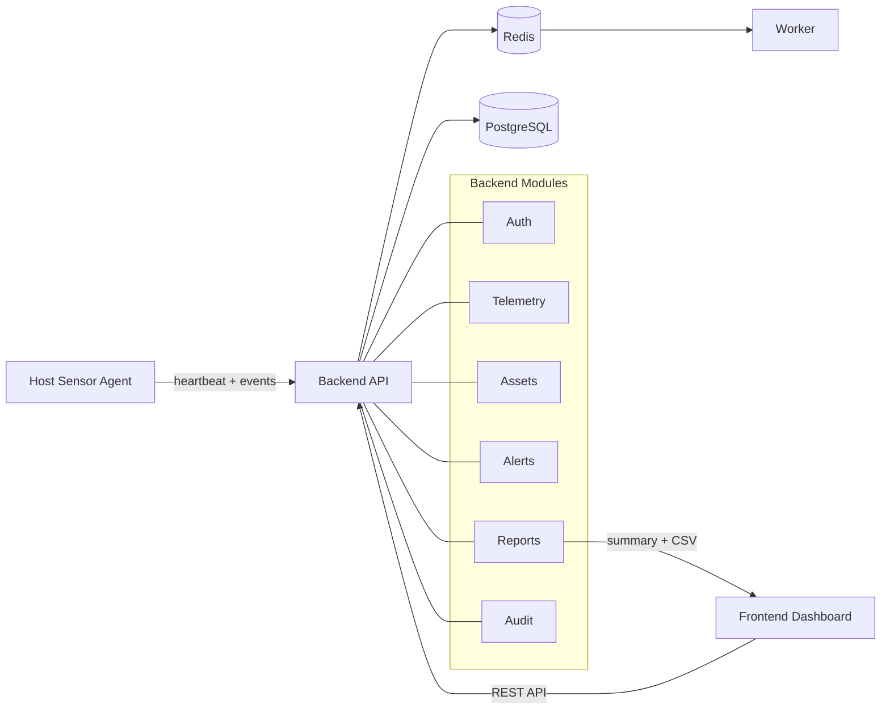

# DevinciWatch

DevinciWatch est un projet de cyber-surveillance réseau orienté SOC.

Le projet vise à couvrir les besoins suivants :

- collecte passive de télémétrie depuis un agent host,
- persistance des événements et inventaire d'assets,
- détection de règles simples et création d'alertes actionnables,
- triage analyste via dashboard web,
- reporting KPI et exports CSV.

## Schéma global de fonctionnement

## Flux métier simplifié

1. L'agent envoie des `heartbeat` et des `events` vers l'API.
2. L'API persiste la télémétrie en base.
3. Les événements mettent à jour ou créent des assets.
4. Les règles de détection créent des alertes actionnables.
5. L'analyste consulte et traite les alertes depuis l'interface web.
6. Le module de reporting expose des KPI et des exports CSV.
7. Le module d'audit journalise les actions sensibles.

## Présentation du projet

- **Auth** : authentification et contrôle d'accès.
- **Telemetry** : ingestion et consultation des événements.
- **Assets** : inventaire enrichi depuis les événements observés.
- **Alerts** : liste, détail et traitement des alertes.
- **Reports** : synthèse et exports.
- **RBAC** : protection des actions sensibles selon le rôle.
- **Audit Trail** : traçabilité des actions critiques.

## Structure du dépôt

- `product/` : futur code source du produit DevinciWatch.
- `website/` : futur site web officiel `https://devinciwatch.com`.
- `documents/` : étude de marché, business model, business plan, références et annexes.

## Navigation rapide

- Produit : `product/README.md`
- Site web : `website/README.md`
- Documents : `documents/README.md`
- Étude de marché : `documents/02_etude_de_marche/rendu_principal.md`
- Business model : `documents/03_business_model/rendu_principal.md`
- Business plan : `documents/04_business_plan/rendu_principal.md`
- Architecture retenue : `documents/08_architecture/rendu_principal.md`

## Documentation associée

- Documents pédagogiques : `documents/01_documents_pedagogiques/README.md`
- Références transverses : `documents/90_references_transverses/README.md`

## État actuel

La branche `main` est organisée pour séparer clairement :

- le futur produit,
- le futur site corporate,
- les livrables académiques et stratégiques déjà consolidés.
