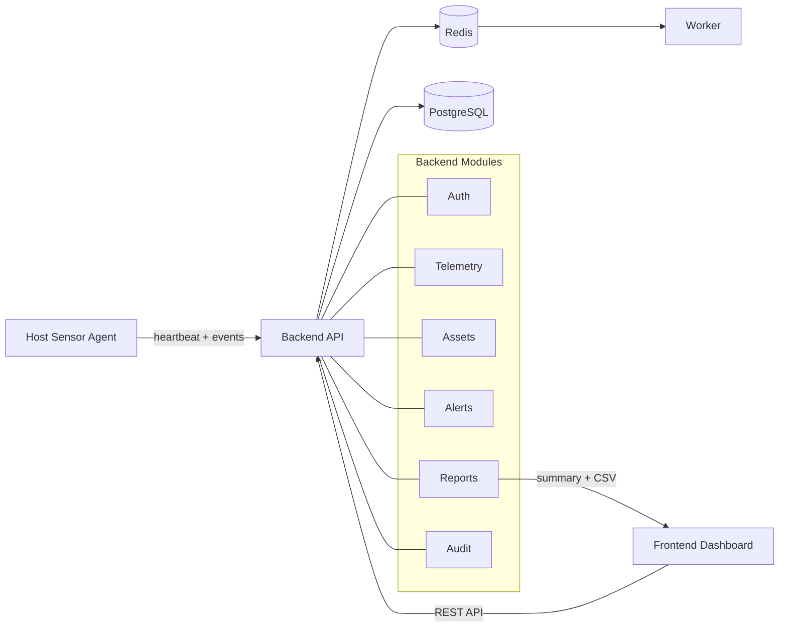

# DevinciWatch

DevinciWatch est un projet de cyber-surveillance reseau oriente SOC.

Le projet vise a couvrir les besoins suivants :

- collecte passive de telemetrie depuis un agent host,
- persistance des evenements et inventaire d'assets,
- detection de regles simples et creation d'alertes actionnables,
- triage analyste via dashboard web,
- reporting KPI et exports CSV.

## Schema global de fonctionnement

## Flux metier simplifie

1. L'agent envoie des `heartbeat` et des `events` vers l'API.
2. L'API persiste la telemetrie en base.
3. Les evenements mettent a jour ou creent des assets.
4. Les regles de detection creent des alertes actionnables.
5. L'analyste consulte et traite les alertes depuis l'interface web.
6. Le module de reporting expose des KPI et des exports CSV.
7. Le module d'audit journalise les actions sensibles.

## Presentation du projet

- **Auth** : authentification et controle d'acces.
- **Telemetry** : ingestion et consultation des evenements.
- **Assets** : inventaire enrichi depuis les evenements observes.
- **Alerts** : liste, detail et traitement des alertes.
- **Reports** : synthese et exports.
- **RBAC** : protection des actions sensibles selon le role.
- **Audit Trail** : tracabilite des actions critiques.

## Structure du depot

- `product/` : futur code source du produit DevinciWatch.
- `website/` : futur site web officiel `https://devinciwatch.com`.
- `documents/` : etude de marche, business model, business plan, references et annexes.

## Navigation rapide

- Produit : `product/README.md`
- Site web : `website/README.md`
- Documents : `documents/README.md`
- Etude de marche : `documents/02_etude_de_marche/rendu_principal.md`
- Business model : `documents/03_business_model/rendu_principal.md`
- Business plan : `documents/04_business_plan/rendu_principal.md`

## Documentation associee

- Documents pedagogiques : `documents/01_documents_pedagogiques/README.md`
- References transverses : `documents/90_references_transverses/README.md`

## Etat actuel

La branche `main` est organisee pour separer clairement :

- le futur produit,
- le futur site corporate,
- les livrables academiques et strategiques deja consolides.
