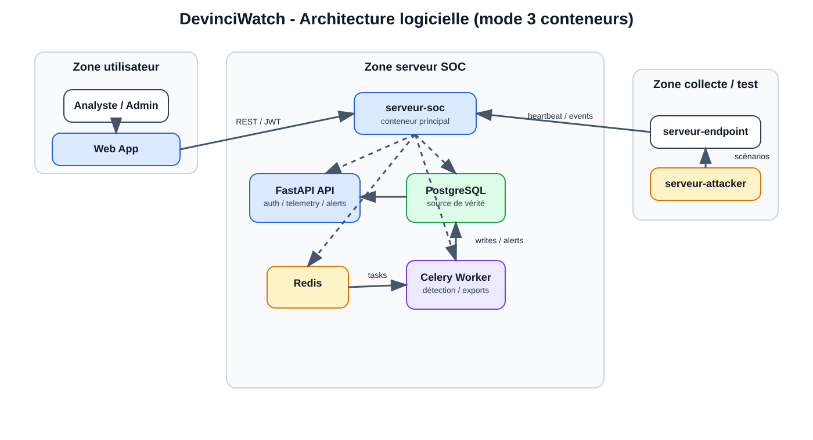
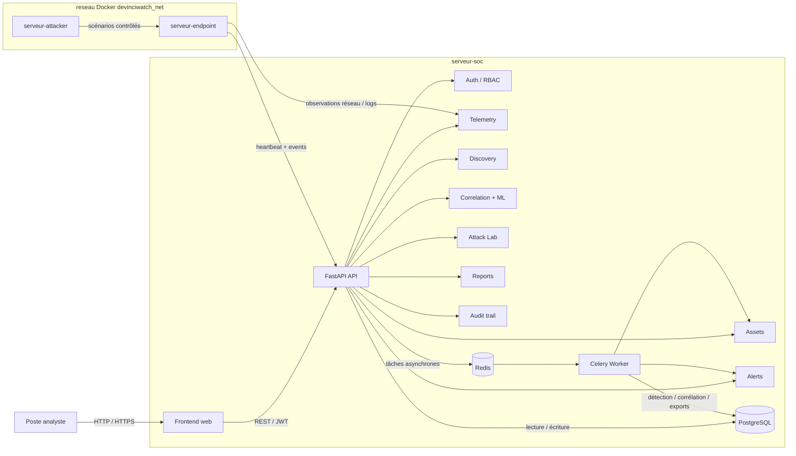

# DevinciWatch



**DevinciWatch** est une plateforme de cybersurveillance réseau orientée SOC, conçue pour la formation, la démonstration et la validation professionnelle.

- Collecte et analyse la télémétrie réseau en temps réel
- Détecte les comportements suspects via des règles et le Machine Learning
- Corrèle les événements par IP, hostname, chaînes d'attaque
- Fournit une interface web SOC complète (Dashboard, Alertes, Inventaire)
- Intègre un **Attack Lab** avec de vrais outils (nmap, nikto, ffuf, hydra)
- Supporte le **multilingue** (FR/EN/ES/DE/AR/IT)

Le dépôt regroupe le cadrage produit, les livrables de gestion de projet, l'architecture technique, le code applicatif et le workflow OpenCode utilisé pour piloter les développements.

---

## 🚀 Version Actuelle

**v0.6.0** - Release 2026-05-08

### Nouveautés majeures
- **EPIC-05** : Corrélation avancée avec score composite (temporal, ML, diversité, sévérité), détection de chaînes d'attaque, corrélation par hostname
- **EPIC-10** : ML temps réel avec Isolation Forest, scoring à l'ingestion, tables ML (ml_models, ml_training_runs, ml_feedback), auto-retraining sur fenêtre glissante
- **EPIC-11** : Attack Lab web complet avec lanceur de scénarios, outils réels (nmap, nikto, ffuf, hydra, httpx), mode batch, historique des jobs
- **i18n** : Support de 6 langues avec Alpine.js, sélecteur dynamique
- **DevOps** : Règles de release régulières (1 par sprint), versioning SemVer

---

## 📋 Table des Matières

- [Objectifs](#objectifs)
- [Architecture](#architecture)
- [Fonctionnalités](#fonctionnalités)
- [Prérequis](#prérequis)
- [Installation](#installation)
- [Accès](#accès)
- [Services Docker](#services-docker)
- [Commandes Utiles](#commandes-utiles)
- [Attack Lab](#attack-lab)
- [Machine Learning](#machine-learning)
- [Troubleshooting](#troubleshooting)
- [Release Management](#release-management)
- [Documentation](#documentation)

---

## Objectifs

- Collecter des `heartbeat` et événements depuis des endpoints supervisés
- Découvrir les actifs, ports, services et comportements réseau observables
- Persister la télémétrie, l'inventaire, les alertes et les journaux d'audit
- Détecter des comportements suspects via des règles simples et le Machine Learning
- Corréler les événements par source, cible, fenêtre temporelle ou séquence logique
- Fournir une interface web d'analyse pour le triage SOC
- Produire des KPI, rapports et exports CSV / JSON
- Exécuter des attaques réelles contrôlées dans un lab Docker pour valider la détection

---

## Architecture

L'architecture retenue distingue la séparation logique des responsabilités et le packaging MVP. Pour la démonstration, `serveur-soc` embarque l'API, le frontend, PostgreSQL, Redis et Celery afin de simplifier l'exécution, tout en conservant une séparation claire des modules applicatifs.


```mermaid
flowchart LR
    Analyst[Poste analyste] -->|HTTP / HTTPS| Web[Frontend web]

    subgraph SOC[serveur-soc]
        Web -->|REST / JWT| API[FastAPI API]
        API --> Auth[Auth / RBAC]
        API --> Telemetry[Telemetry]
        API --> Discovery[Discovery]
        API --> Assets[Assets]
        API --> Alerts[Alerts]
        API --> Correlation[Correlation + ML]
        API --> AttackLab[Attack Lab]
        API --> Reports[Reports]
        API --> Audit[Audit trail]
        
        API -->|lecture / écriture| DB[(PostgreSQL)]
        API -->|tâches asynchrones| Queue[(Redis)]
        Queue --> Worker[Celery Worker]
        Worker -->|détection / corrélation / exports| DB
        Worker --> Alerts
        Worker --> Assets
    end

    subgraph Lab[reseau Docker devinciwatch_net]
        Endpoint[serveur-endpoint]
        Attacker[serveur-attacker]
    end

    Endpoint -->|heartbeat + events| API
    Endpoint -->|observations réseau / logs| Telemetry
    Attacker -->|scénarios contrôlés| Endpoint
```

---

## Fonctionnalités

### 🔐 Dashboard SOC
- Vue d'ensemble en temps réel (SSE)
- Métriques : événements, alertes actives, actifs, agents
- Alertes récentes et événements temps réel
- Indicateur de connexion API

### 🚨 Alertes
- Création automatique via règles métier
- Gestion du cycle de vie : new → acknowledged → investigating → resolved
- Filtrage par sévérité, statut
- Export JSON avec métadonnées

### 📡 Événements
- Ingestion via API REST
- Types : heartbeat, port_scan, brute_force, web_attack, etc.
- Détail complet avec raw payload
- Scoring ML en temps réel

### 🖥️ Inventaire (Assets)
- Découverte automatique via télémétrie
- Informations : IP, hostname, OS, type, interfaces
- Suivi de l'état (actif/inactif)
- Clic → détail avec alertes et événements liés

### 🔗 Corrélation (EPIC-05)
- **Par IP source** : Regroupement des événements similaires
- **Par hostname** : Corrélation basée sur le nom d'hôte
- **Fenêtre temporelle** : Détection de bursts d'activité
- **Chaînes d'attaque** : Séquence logique (recon → exploit → exfiltration)
- **Score composite** : 4 facteurs pondérés (temporal 35%, ML 25%, diversité 20%, sévérité 20%)
- Timeline avec ordre de séquence et scores ML

### 🤖 Machine Learning (EPIC-10)
- **Isolation Forest** : Algorithme principal (scalabilité O(n log n))
- **Scoring temps réel** : Chaque événement reçoit un score d'anomalie
- **Auto-retraining** : Fenêtre glissante, réentraînement automatique
- **ML Feedback** : Annotation humaine (vrai/faux positif)
- **Drift detection** : Détection de changement de distribution
- Tables : `ml_models`, `ml_training_runs`, `ml_feedback`

### ⚔️ Attack Lab (EPIC-11)
- **Interface web dédiée** avec lanceur de scénarios
- **Outils réels intégrés** : nmap, nikto, ffuf, hydra, httpx, slowhttptest
- **Scénarios variés** :
  - Reconnaissance (nmap, httpx)
  - Brute force (hydra)
  - Web attacks (nikto, ffuf)
  - DoS contrôlé (slowhttptest)
  - Chaînes complètes (recon → brute force → exploitation → exfiltration)
- **Mode batch** : Lancement de plusieurs attaques en séquence
- **Gestion des jobs** : Suivi en temps réel, logs, arrêt d'urgence
- **Sécurité** : Cibles limitées à l'allowlist Docker, aucun accès Internet

### 🌍 Multilingue (i18n)
- **6 langues supportées** : Français, Anglais, Espagnol, Allemand, Arabe, Italien
- **Sélecteur dynamique** dans l'interface
- **Alpine.js** : Fonction `t(key)` pour la traduction
- **Fichiers JSON** dans `/static/i18n/`

### 📊 Rapports
- Exports CSV : Alertes, Événements, Actifs
- Exports JSON : Alertes avec métadonnées, événements, corrélations
- KPI et synthèses pour démonstration

### 🔒 Audit & Sécurité
- Journalisation de toutes les actions sensibles
- RBAC : Rôles admin/user
- Authentification JWT
- Traçabilité complète (qui, quoi, quand)

---

## Prérequis

- **Docker** + **Docker Compose v2** (pas besoin de sudo)
- **Git**
- **Ports disponibles** : `8000` (API + Frontend), `5432` (PostgreSQL), `6379` (Redis)
- **Ressources recommandées** : 4 GB RAM, 2 CPU

---

## Installation

### 1. Cloner le dépôt
```bash
git clone https://github.com/votre-utilisateur/PROJET-M2-CYBER-2026.git
cd PROJET-M2-CYBER-2026/new
```

### 2. Configuration environnement
```bash
cd product
cp .env.example .env
# Éditer .env si nécessaire (credentials par défaut fournis)
```

### 3. Lancer avec Docker Compose
```bash
docker compose up --build -d
```

⏳️ **Note** : Le premier build peut prendre 10-15 minutes (téléchargement des dépendances Python, compilation d'outils comme hydra).

### 4. Vérifier le démarrage
```bash
docker compose ps
# Tous les services doivent être "Up" ou "healthy"
```

---

## Accès

| Service | URL | Description |
|---------|-----|-------------|
| **Interface Web** | http://localhost:8000 | Dashboard SOC principal |
| **API Docs (Swagger)** | http://localhost:8000/docs | Documentation interactive API |
| **API ReDoc** | http://localhost:8000/redoc | Alternative documentation |
| **Health Check** | http://localhost:8000/health | État de l'API |

### Credentials par défaut
- **Username** : `admin`
- **Password** : `ChangeMeNow123!`

---

## Services Docker

### `serveur-soc` (Port 8000)
- FastAPI + Uvicorn
- Frontend Alpine.js + Tailwind CSS
- SQLAlchemy + PostgreSQL
- Redis + Celery

### `serveur-endpoint`
- Agent de collecte télémétrie
- Envoie heartbeats et événements
- Observre le réseau Docker

### `serveur-attacker`
- Outils : nmap, nikto, ffuf, hydra, httpx, slowhttptest
- Scénarios d'attaque contrôlés
- Accès limité au réseau Docker interne

### `postgres`
- PostgreSQL 16
- Base `devinciwatch`
- Volume persistant : `postgres_data`

### `redis`
- Redis 7
- File d'attente Celery
- Cache et Pub/Sub (SSE)

---

## Commandes Utiles

### Gestion des containers
```bash
# Démarrer tous les services
docker compose up -d

# Arrêter tous les services
docker compose down

# Voir les logs
docker compose logs -f serveur-soc

# Rebuild après changement de code
docker compose up --build -d

# Redémarrer un service spécifique
docker compose restart serveur-soc
```

### Debugging
```bash
# Entrer dans un container
docker compose exec serveur-soc bash

# Voir les variables d'environnement
docker compose exec serveur-soc env

# Vérifier la santé de l'API
curl http://localhost:8000/health
```

### Base de données
```bash
# Se connecter à PostgreSQL
docker compose exec postgres psql -U postgres -d devinciwatch

# Reset complet (⚠️ supprime toutes les données)
docker compose down -v
docker compose up --build -d
```

---

## Attack Lab

### Accès
1. Ouvrez l'interface web : http://localhost:8000
2. Connectez-vous avec `admin / ChangeMeNow123!`
3. Cliquez sur **Attack Lab** dans la sidebar (icône alerte)
4. Choisissez un scénario ou lancez une chaîne complète

### Scénarios Disponibles

| ID | Nom | Outil | Description |
|----|------|------|-------------|
| `port_scan` | Port Scan | nmap | Scan de ports TCP (low: 22,80,443 / high: tous) |
| `http_recon` | HTTP Recon | httpx | Fingerprint HTTP, technologies détectées |
| `dir_bruteforce` | Directory Fuzz | ffuf | Brute force de répertoires web |
| `web_vuln_scan` | Web Vulnerability | nikto | Scan de vulnérabilités web |
| `brute_force` | Brute Force | hydra | Tentatives de connexion (SSH/HTTP) |
| `dos_slow` | Slow DoS | slowhttptest | Test DoS lent et contrôlé |
| `attack_chain_full` | Full Kill Chain | Multiple | Recon → brute force → web attack → exfil |

### Modes d'exécution
- **Simple** : Un scénario à la fois
- **Batch** : Plusieurs scénarios en séquence
- **Chaîne** : Séquences logiques prédéfinies

### Sécurité
- ✅ Cibles limitées à l'allowlist (`serveur-endpoint`, IPs Docker locales)
- ✅ Aucun accès Internet depuis l'attaquant
- ✅ Intensité configurable : low / medium / high / stress
- ✅ Bouton **STOP ALL** pour arrêter tout
- ✅ Durée maximale par job

---

## Machine Learning

### Isolation Forest (Principal)
- **Algorithme** : Isolation Forest (sklearn)
- **Contamination** : Dynamique (0.05 - 0.15 selon historique)
- **Features** : event_type (encodé), severity (ordinal), source_ip (hash), target_ip
- **Scoring** : 0.0 (normal) à 1.0 (anomalie)

### Temps Réel
- Chaque événement est scoré à l'ingestion
- Les scores sont publiés via SSE vers le dashboard
- Mise à jour immédiate des alertes

### Auto-Retraining
- Base de données : `ml_training_runs`
- Fréquence : Toutes les 15 min ou 1000 événements
- Fenêtre : 5000 derniers événements
- Validation : Comparaison ancien/nouveau modèle avant remplacement

### Consultation
```bash
# Résumé ML via API
curl -H "Authorization: Bearer VOTRE_TOKEN" http://localhost:8000/correlation/ml-summary

# Corps d'une alerte avec score ML
curl -H "Authorization: Bearer VOTRE_TOKEN" http://localhost:8000/alerts/1
```

---

## Troubleshooting

### Build long ou échoué (serveur-attacker)
**Symptôme** : Le build de `serveur-attacker` prend > 10 min ou échoue.

**Solutions** :
```bash
# 1. Vérifier l'espace disque
df -h

# 2. Rebuild propre
docker compose down
docker system prune -a
docker compose up --build -d

# 3. Si hydra échoue à compiler, utiliser l'image prébuild
# (Modifier Dockerfile attacker pour utiliser une image avec hydra inclus)
```

### Port 8000 déjà utilisé
```bash
# Changer le port dans docker-compose.yml
# "8080:8000" au lieu de "8000:8000"
```

### Problème d'authentification
```bash
# Réinitialiser le mot de passe admin
docker compose exec serveur-soc python -c "
from app.auth.service import create_user
from app.core.database import SessionLocal
db = SessionLocal()
create_user(db, 'admin', 'admin@local', 'NewPass123!', 'admin')
db.close()
"
```

### Reset complet
```bash
# ⚠️ Supprime toutes les données
docker compose down -v
rm -rf product/backend/alembic/versions/*
docker compose up --build -d
```

---

## Release Management

### Règles (v0.6.0+)
- **Cadence** : 1 release par sprint (toutes les 1-2 semaines)
- **Versioning** : SemVer `vMAJOR.MINOR.PATCH`
- **Changelog** : Obligatoire pour chaque release
- **Validation** : Docker + tests + migrations DB avant release

### Créer une release
```bash
# 1. Commit les changements
git add -A
git commit -m "Feature: description"

# 2. Créer le tag
git tag -a v0.7.0 -m "Release v0.7.0: Nouvelles fonctionnalités"
git push origin v0.7.0

# 3. Créer GitHub Release
# (Via l'interface GitHub avec description du changelog)
```

### Historique des versions
- **v0.6.0** (2026-05-08) : EPIC-05/10/11, i18n, Attack Lab
- **v0.5.0** (2026-05-06) : Dashboard, Alertes, Événements, Inventaire
- **v0.4.0** (2026-05-04) : Auth, Audit, RBAC
- **v0.3.0** (2026-05-02) : Télémétrie, Discovery
- **v0.2.0** (2026-04-28) : Backend FastAPI, PostgreSQL
- **v0.1.0** (2026-04-20) : Initialisation projet

---

## Documentation

### Liens Utiles
- **Produit** : [product/README.md](product/README.md)
- **Site web** : [website/README.md](website/README.md)
- **Architecture** : [documents/08_architecture/rendu_principal.md](documents/08_architecture/rendu_principal.md)
- **Cahier des charges** : [documents/06_cahier_des_charges/rendu_principal.md](documents/06_cahier_des_charges/rendu_principal.md)
- **Gestion de projet** : [documents/07_gestion_de_projet/README.md](documents/07_gestion_de_projet/README.md)
- **DevOps Rules** : [documents/07_gestion_de_projet/devops-release-rules.md](documents/07_gestion_de_projet/devops-release-rules.md)
- **Workflow OpenCode** : [agentic/readme.md](agentic/readme.md)

### Études de marché
- [documents/02_etude_de_marche/rendu_principal.md](documents/02_etude_de_marche/rendu_principal.md)

### Business
- [documents/03_business_model/rendu_principal.md](documents/03_business_model/rendu_principal.md)
- [documents/04_business_plan/rendu_principal.md](documents/04_business_plan/rendu_principal.md)

---

## 🎯 Positionnement

DevinciWatch n'a pas vocation à reproduire toute la complexité d'un SIEM enterprise. Le MVP privilégie une architecture claire, démontable et défendable : collecte réseau, détection, corrélation, triage, reporting et preuves, dans un environnement reproductible adapté à une validation professionnelle.

---

## 📄 Licence

Projet réalisé dans le cadre de la formation **Cybersecurity (M2) - 2026**.

---

## 🤝 Contribuer

1. Fork le projet
2. Créer une branche (`git checkout -b feature/ma-fonctionnalite`)
3. Commit (`git commit -m 'Ajout: nouvelle fonctionnalité'`)
4. Push (`git push origin feature/ma-fonctionnalite`)
5. Ouvrir une Pull Request

---

**DevinciWatch v0.6.0** - Dernière mise à jour : 08 Mai 2026
