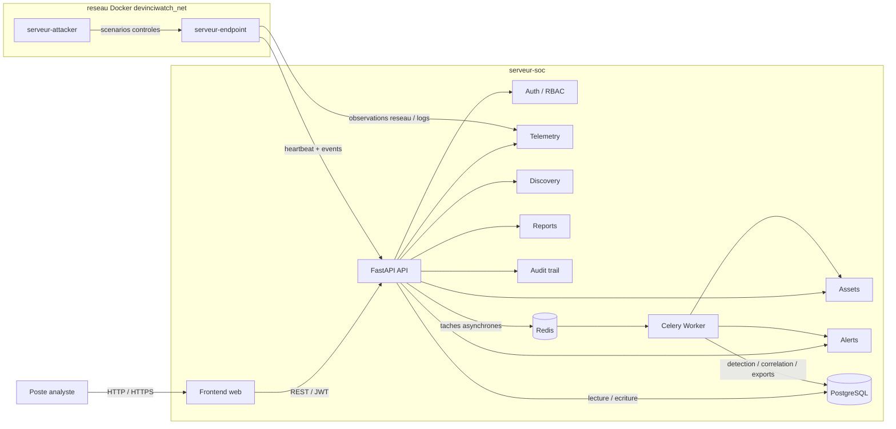

# DevinciWatch

**DevinciWatch** est une plateforme de cybersurveillance réseau orientée SOC.

- Collecte et analyse de la télémétrie
- Détection de comportements suspects
- Génération d'alertes actionnables
- Preuves exploitables pour l'analyse

Le dépôt regroupe le cadrage produit, les livrables de gestion de projet, l'architecture technique, le futur code applicatif et le workflow OpenCode utilisé pour piloter les développements.

## Objectifs

- Collecter des `heartbeat` et événements depuis un endpoint supervisé.
- Découvrir les actifs, ports, services et comportements réseau observables.
- Persister la télémétrie, l'inventaire, les alertes et les journaux d'audit.
- Détecter des comportements suspects via des règles simples et démontrables.
- Corréler les événements par source, cible, fenêtre temporelle ou séquence.
- Fournir une interface web d'analyse pour le triage SOC.
- Produire des KPI, rapports et exports CSV / JSON.
- Exécuter une démonstration reproductible dans un lab Docker contrôlé.

## Architecture Cible MVP

L'architecture retenue distingue la séparation logique des responsabilités et le packaging MVP. Pour la démonstration, `serveur-soc` embarque l'API, le frontend, PostgreSQL, Redis et le worker Celery afin de simplifier l'exécution, tout en conservant une séparation claire des modules applicatifs.

```mermaid
flowchart LR
    Analyst[Poste analyste] -->|HTTP / HTTPS| Web[Frontend web]

    subgraph SOC[serveur-soc]
        Web -->|REST / JWT| API[FastAPI API]
        API --> Auth[Auth / RBAC]
        API --> Telemetry[Telemetry]
        API --> Discovery[Discovery]
        API --> Assets[Assets]
        API --> Alerts[Alerts]
        API --> Reports[Reports]
        API --> Audit[Audit trail]

        API -->|lecture / ecriture| DB[(PostgreSQL)]
        API -->|taches asynchrones| Queue[(Redis)]
        Queue --> Worker[Celery Worker]
        Worker -->|detection / correlation / exports| DB
        Worker --> Alerts
        Worker --> Assets
    end

    subgraph Lab[reseau Docker devinciwatch_net]
        Endpoint[serveur-endpoint]
        Attacker[serveur-attacker]
    end

    Endpoint -->|heartbeat + events| API
    Endpoint -->|observations reseau / logs| Telemetry
    Attacker -->|scenarios controles| Endpoint
```

## Flux Principal

1. `serveur-endpoint` observe le réseau de lab, collecte des logs et envoie des `heartbeat` et `events` vers l'API.
2. `serveur-soc` valide les payloads, authentifie l'agent et persiste les données dans PostgreSQL.
3. Redis met en file les traitements non synchrones : détection, corrélation, enrichissement, exports.
4. Le worker Celery applique les règles métier et met à jour les actifs, alertes et indicateurs.
5. L'analyste consulte le dashboard, traite les alertes et exporte les preuves depuis l'interface web.
6. `serveur-attacker` génère uniquement des scénarios contrôlés pour valider la détection dans le lab.

## Modules Fonctionnels

- **Auth / RBAC** : authentification utilisateur, rôles et contrôle des accès sensibles.
- **Telemetry** : ingestion des `heartbeat`, événements agent et observations réseau.
- **Discovery** : scan de plage IP, identification des ports ouverts et services observés.
- **Assets** : inventaire des hôtes, enrichissement et suivi des actifs supervisés.
- **Alerts** : création, enrichissement, consultation et traitement analyste des alertes.
- **Correlation** : regroupement des signaux par IP source, cible, fenêtre temporelle ou séquence.
- **Reports** : KPI, synthèses et exports CSV / JSON pour la démonstration.
- **Audit** : journalisation des actions sensibles et traçabilité projet.

## Stack Technique

- **Backend** : Python, FastAPI, SQLAlchemy, Pydantic, Alembic.
- **Base de données** : PostgreSQL.
- **Asynchrone** : Redis, Celery.
- **Frontend** : interface web intégrée au conteneur `serveur-soc` pour le MVP.
- **Lab** : Docker Compose avec `serveur-soc`, `serveur-endpoint` et `serveur-attacker`.
- **Workflow projet** : OpenCode, agents spécialisés, commands et skills dédiés.

## Structure Du Dépôt

- [`product/`](product/) : futur code source du produit DevinciWatch.
- [`website/`](website/) : futur site web officiel [devinciwatch.com](https://devinciwatch.com).
- [`documents/`](documents/) : livrables pédagogiques, stratégiques, fonctionnels, projet et architecture.
- [`agentic/`](agentic/) : configuration OpenCode, agents, commands et skills du workflow projet.

## Documentation De Référence

- Produit : [product/README.md](product/README.md)
- Site web : [website/README.md](website/README.md)
- Documents : [documents/README.md](documents/README.md)
- Architecture retenue : [documents/08_architecture/rendu_principal.md](documents/08_architecture/rendu_principal.md)
- Cahier des charges : [documents/06_cahier_des_charges/rendu_principal.md](documents/06_cahier_des_charges/rendu_principal.md)
- Gestion de projet : [documents/07_gestion_de_projet/README.md](documents/07_gestion_de_projet/README.md)
- Workflow agentique : [agentic/readme.md](agentic/readme.md)
- Étude de marché : [documents/02_etude_de_marche/rendu_principal.md](documents/02_etude_de_marche/rendu_principal.md)
- Business model : [documents/03_business_model/rendu_principal.md](documents/03_business_model/rendu_principal.md)
- Business plan : [documents/04_business_plan/rendu_principal.md](documents/04_business_plan/rendu_principal.md)

## État Du Projet

Le projet est en phase de consolidation MVP. Les documents de cadrage, de gestion de projet et d'architecture définissent la trajectoire produit avant l'implémentation complète dans `product/`.

Priorités actuelles :

- implémenter le socle applicatif FastAPI ;
- construire l'ingestion agent et les premiers événements ;
- mettre en place l'inventaire d'actifs et les alertes ;
- préparer le dashboard SOC ;
- valider la démonstration Docker contrôlée.

## Positionnement

DevinciWatch n'a pas vocation à reproduire toute la complexité d'un SIEM enterprise. Le MVP privilégie une architecture claire, démontrable et défendable : collecte réseau, détection, corrélation, triage, reporting et preuves, dans un environnement reproductible adapté à une validation professionnelle.
