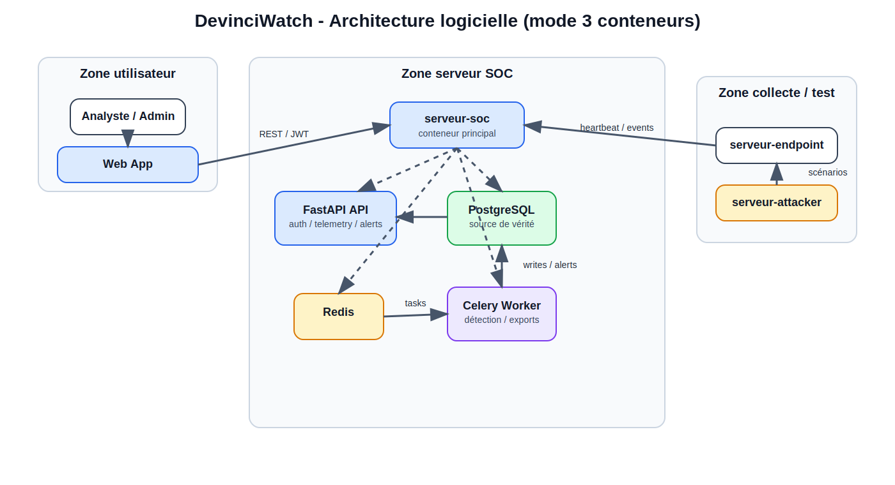
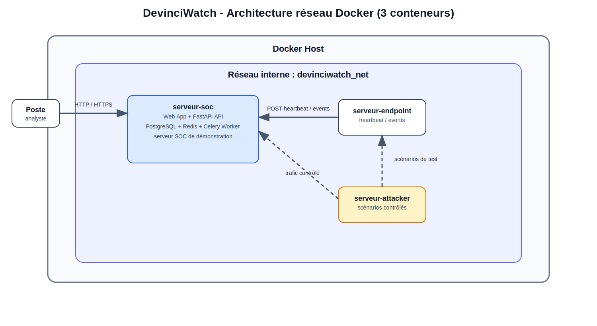
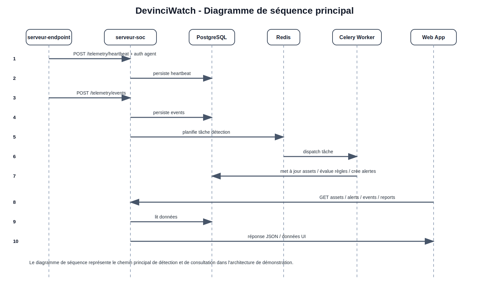

# Architecture définitive - DevinciWatch

## 1. Statut du document

Ce document fixe l'architecture de référence du produit DevinciWatch. Il traduit les exigences du [cahier des charges](../06_cahier_des_charges/rendu_principal.md) en choix techniques, composants, flux, responsabilités et contraintes de démonstration.

Sauf décision explicite ultérieure, cette architecture est considérée comme l'architecture définitive de départ pour le redéveloppement de l'application.

Le document distingue volontairement deux niveaux :

- l'architecture produit cible ;
- l'architecture de démonstration Docker retenue pour le MVP et la validation produit.

Cette distinction est importante : l'architecture de démonstration simplifie le packaging afin de faciliter la validation, tandis que l'architecture logique conserve une séparation claire des responsabilités pour préparer les évolutions ultérieures.

## 2. Objectif

Ce document définit l'architecture cible du produit DevinciWatch.

L'objectif est de concevoir une application de cybersurveillance réseau orientée SOC, capable de :

- recevoir de la télémétrie depuis un agent ;
- persister des événements et un inventaire d'actifs ;
- détecter des comportements suspects ;
- corréler plusieurs événements ou attaques liés à une même source ou à une même fenêtre temporelle ;
- générer des alertes actionnables ;
- exposer une interface web d'analyse ;
- produire des exports et des éléments de preuve.

L'architecture doit rester :

### 2.1. Contraintes validées par les données (mai 2026)

L'analyse de 1 638 enregistrements (NVD 30, CISA KEV 1 587, GitHub 10, CERT-FR 10) impose :
- **Scalabilité** : Score intensité 1 114,8 → FastAPI + Celery + Redis + PostgreSQL
- **Couverture** : 1 587 vulnérabilités KEV + 317 ransomware → Moteur règles YARA/Sigma
- **Performance** : 30 CVEs 2026 (7 Critiques) → Temps détection < 5 min, API collecteurs multi-sources
- **Stockage** : 1 638 enregistrements normalisés → PostgreSQL optimisé, index sur cve_id/vendor

- propre ;
- défendable en revue projet ;
- réaliste pour un MVP ;
- extensible pour les itérations suivantes.

La qualité attendue n'est donc pas seulement technique. L'architecture doit pouvoir être expliquée, justifiée et reliée aux besoins produit : observation réseau, détection, alertes, exports, traçabilité et démonstration reproductible.

## 3. Stack cible

### Backend

- Python
- FastAPI
- SQLAlchemy
- Pydantic
- Alembic

### Base de données

- PostgreSQL

### Traitements asynchrones

- Redis
- Celery

### Frontend

- frontend web intégré au même conteneur que le backend pour le MVP
- interface web servie par le serveur SOC

### Conteneurisation et démo

- Docker Compose
- topologie de démonstration en 3 conteneurs

### Topologie Docker retenue

- un conteneur `serveur-soc`
- un conteneur `serveur-endpoint`
- un conteneur `serveur-attacker`

## 4. Principes d'architecture

Les principes retenus sont les suivants :

- séparation claire entre collecte, traitement, stockage et présentation ;
- organisation par domaines fonctionnels ;
- logique métier centralisée côté backend ;
- traitements lourds ou différés sortis du chemin synchrone ;
- traçabilité native des actions sensibles ;
- structure adaptée à une démonstration rapide, mais suffisamment propre pour évoluer ;
- environnement de test reproductible via conteneurs séparés ;
- simulation contrôlée de comportements suspects sans embarquer de code destructeur réel ;
- corrélation temporelle et contextuelle des signaux pour réduire le bruit et enrichir les alertes ;
- interface d'analyse moderne orientée investigation, métriques et preuves.

## 5. Architecture logicielle



```text
[serveur-endpoint] -- heartbeat / events --> [serveur-soc]
[Interface web] -- REST / JWT --------> [serveur-soc]
[serveur-soc] - logique interne ---> [FastAPI API]
[serveur-soc] - logique interne ---> [PostgreSQL]
[serveur-soc] - logique interne ---> [Redis]
[serveur-soc] - logique interne ---> [Celery Worker]
[Celery Worker] ----------------------> [PostgreSQL]
```

## 6. Lecture de l'architecture logicielle

- l'utilisateur accède uniquement à l'application web ;
- l'application web est hébergée dans le même conteneur que l'API pour le MVP ;
- le serveur-endpoint envoie ses données uniquement au serveur-soc ;
- le serveur-attacker ne parle pas directement à l'interface ;
- PostgreSQL, Redis et Celery restent logiquement séparés, mais sont embarqués dans le serveur-soc pour la démonstration ;
- la logique produit reste séparée par composants, même si l'emballage Docker de démonstration est compact.

Le choix d'embarquer plusieurs services dans `serveur-soc` est un choix de packaging MVP. Il simplifie la démonstration et la validation, sans remettre en cause la séparation logique entre API, base de données, file de tâches et worker. En implémentation, ces processus devront être lancés de manière explicite et supervisable dans le conteneur de démonstration.

Ce compromis doit être présenté comme une décision d'ingénierie adaptée au contexte MVP. En production, ces services pourraient être séparés dans des conteneurs distincts, mais cette séparation augmenterait inutilement la complexité du MVP et rendrait la démonstration moins directe.

## 7. Architecture réseau Docker



L'environnement de développement et de démonstration est retenu sous la forme de trois conteneurs :

1. un conteneur `serveur-soc` ;
2. un conteneur `serveur-endpoint` ;
3. un conteneur `serveur-attacker`.

Le conteneur `serveur-soc` centralise l'application web, l'API FastAPI, PostgreSQL, Redis et le worker Celery pour simplifier le MVP et la validation.

```text
DOCKER HOST
  réseau interne : devinciwatch_net

  [Poste analyste]
         |
         | HTTP / HTTPS
         v
  [serveur-soc]
         |
         +--> Frontend Web
         +--> FastAPI API
         +--> PostgreSQL
         +--> Redis
         +--> Celery Worker

  [serveur-endpoint] -------------> [serveur-soc]
         ^
         |
         | trafic réseau, logs, comportements suspects
         |
  [serveur-attacker]

  [serveur-attacker] -- trafic contrôle --> [serveur-endpoint]
```

### Rôles des conteneurs de test

#### `serveur-soc`

Responsabilités :

- exposer l'application ;
- servir l'API ;
- servir le frontend de démonstration ;
- centraliser les appels fonctionnels ;
- embarquer PostgreSQL, Redis et Celery pour la démonstration.

Composants internes embarqués :

- FastAPI API ;
- Frontend Web ;
- PostgreSQL ;
- Redis ;
- Celery Worker ;

#### `serveur-endpoint`

Responsabilités :

- jouer le rôle d'un hôte supervisé ;
- observer le trafic réseau sur l'interface du conteneur ;
- collecter et parser les fichiers log utiles ;
- relever les comportements suspects locaux ;
- remonter `heartbeat` et `events` vers `serveur-soc`.

#### `serveur-attacker`

Responsabilités :

- produire des scénarios de test ;
- simuler des comportements suspects contrôlés ;
- générer du trafic ou des comportements attendus pour la détection sur le serveur-endpoint.

Contraintes :

- pas de charge destructive réelle ;
- pas de code malware réel ;
- scénarios strictement prévisibles et démontrables.

## 8. Diagramme de séquence principal



```text
1. serveur-endpoint -> serveur-soc : POST /telemetry/heartbeat
2. serveur-soc -> PostgreSQL : persistance du heartbeat

3. serveur-endpoint -> serveur-soc : POST /telemetry/events
4. serveur-soc -> PostgreSQL : persistance des événements
5. serveur-soc -> Redis : mise en file d'une tâche de détection
6. Redis -> Celery Worker : dispatch de la tâche
7. Celery Worker -> PostgreSQL : mise à jour des actifs / application des règles / création des alertes

8. Interface web -> serveur-soc : consultation assets / alerts / events / reports
9. serveur-soc -> PostgreSQL : lecture des données
10. serveur-soc -> Interface web : réponse
```

## 9. Composants principaux

### 9.1 Agent de collecte

Rôle :

- collecter des `heartbeat` ;
- observer le trafic réseau ;
- analyser des fichiers log ;
- relever des comportements suspects ;
- pousser les données vers l'API.

Contraintes :

- simple ;
- robuste ;
- peu couplé au reste du système ;
- authentifié auprès de l'API par un secret d'agent ou une clé API dédiée.

### 9.2 API Backend FastAPI

Rôle :

- authentifier les utilisateurs ;
- authentifier les agents de collecte ;
- recevoir les données agent ;
- exposer les endpoints métiers ;
- valider et normaliser les payloads ;
- piloter les règles métier ;
- piloter les règles de corrélation ;
- retourner les données au frontend.

Les routes d'ingestion agent doivent être séparées des routes utilisateur. Elles doivent accepter uniquement des agents connus du serveur SOC, via un secret d'agent, une clé API ou un mécanisme équivalent stocké côté serveur. Cette séparation limite les confusions entre actions humaines et remontées automatiques, facilite l'audit et prépare un durcissement ultérieur de l'authentification agent.

L'API constitue le point central du système et sera hébergée dans le conteneur `serveur-soc`.

### 9.3 Base PostgreSQL

Rôle :

- stocker les utilisateurs ;
- stocker les actifs ;
- stocker les événements ;
- stocker les alertes ;
- stocker les journaux d'audit ;
- stocker les informations utiles aux exports et rapports.

PostgreSQL est la source de vérité fonctionnelle et sera embarquée dans `serveur-soc` pour la phase MVP de démonstration.

### 9.4 Redis + Worker Celery

Rôle :

- sortir du chemin synchrone les traitements non immédiats ;
- exécuter les règles de détection ;
- exécuter les règles de corrélation ;
- recalculer certains indicateurs ;
- générer des exports ;
- préparer certains rapports ou tâches différées.

Redis et Celery seront également embarqués dans `serveur-soc` pour la phase MVP de démonstration.

### 9.5 Frontend web

Rôle :

- authentification ;
- visualisation d'un dashboard moderne ;
- visualisation de métriques SOC ;
- consultation de l'historique d'alertes et d'événements ;
- consultation des journaux et traces ;
- consultation des actifs ;
- consultation des événements ;
- consultation et traitement des alertes ;
- déclenchement d'exports CSV et JSON pour le MVP, avec XML en extension si le calendrier le permet ;
- visualisation géographique des attaques ;
- affichage des IP attaquantes et de leur récurrence ;
- consultation des corrélations entre événements et campagnes suspectes.

L'enrichissement géographique des IP attaquantes doit rester pragmatique. Pour le MVP, il peut s'appuyer sur une base GeoIP locale, un jeu de données simulé ou un enrichissement contrôlé sans dépendance externe obligatoire pendant la validation.

Le frontend est intégré au même conteneur que le backend pour le MVP et ne doit parler qu'à l'API locale du serveur-soc.

### 9.6 Simulateur de test

Rôle :

- exécuter des scénarios de test de sécurité contrôlés ;
- alimenter l'agent ou le serveur en comportements observables ;
- produire des preuves de détection pour la démonstration.

Ce composant existe pour le lab Docker de test, pas pour la production. Il sera hébergé dans le conteneur `serveur-attacker`.

## 10. Capacités fonctionnelles réseau imposées par le projet

L'architecture doit couvrir explicitement les capacités demandées dans le kick-off :

- détection des équipements connectés ;
- scan de plage IP ;
- identification des ports ouverts ;
- récupération d'informations sur les services réseau ;
- observation du trafic réseau ;
- détection de comportements suspects ou malveillants ;
- corrélation de signaux répétés ou reliés à une même source attaquante.

Ces capacités seront portées principalement par le serveur-endpoint et par les modules backend associés à la télémétrie, aux actifs et aux alertes.

Dans l'environnement Docker de démonstration, les scans et observations doivent rester limités au réseau de lab `devinciwatch_net`. Si l'observation réseau nécessite des droits particuliers, ils doivent être explicitement bornés au conteneur `serveur-endpoint` et documentés dans la configuration Docker, par exemple via les capacités Linux strictement nécessaires (`NET_RAW` ou `NET_ADMIN` selon l'implémentation retenue).

## 11. Découpage fonctionnel du backend

Le backend doit être organisé par domaines métier.

Modules recommandés :

- `auth`
- `telemetry`
- `discovery`
- `assets`
- `alerts`
- `correlation`
- `reports`
- `audit`
- `core`

### `auth`

Responsabilités :

- login ;
- génération et validation des tokens ;
- endpoint `/me` ;
- gestion des rôles.

### `telemetry`

Responsabilités :

- réception de `heartbeat` ;
- réception d'événements ;
- validation des payloads ;
- normalisation minimale avant persistance.

### `discovery`

Responsabilités :

- scan de plages IP ;
- identification des ports ouverts ;
- récupération d'informations de services réseau ;
- collecte d'observations liées au trafic réseau ;
- transmission de ces résultats au module `assets` et au module `alerts`.

### `assets`

Responsabilités :

- création et mise à jour de l'inventaire ;
- enrichissement de base des actifs ;
- consultation des actifs par l'interface.

### `alerts`

Responsabilités :

- création d'alertes depuis les règles ;
- enrichissement des alertes depuis les corrélations ;
- consultation ;
- détail ;
- traitement analyste ;
- cycle de vie des statuts.

### `correlation`

Responsabilités :

- regrouper plusieurs événements liés à une même IP source, un même attaquant présumé ou une même cible ;
- corréler des séquences répétées dans une fenêtre de temps ;
- détecter des répétitions horaires, journalières ou comportementales ;
- produire des agrégats de type campagne, rafale, scan récurrent ou comportement persistant ;
- alimenter le module `alerts` avec des alertes enrichies et priorisées.

### `reports`

Responsabilités :

- synthèse de KPI ;
- exports CSV ;
- exports JSON ;
- export XML optionnel si le calendrier le permet ;
- vue exploitable pour la démonstration et la preuve.

### `audit`

Responsabilités :

- journalisation des actions sensibles ;
- conservation des traces ;
- consultation restreinte.

### `core`

Responsabilités :

- configuration ;
- sécurité transverse ;
- dépendances communes ;
- utilitaires partagés.

## 12. Structure logique FastAPI recommandée

Structure cible :

```text
app/
  main.py
  core/
  auth/
  telemetry/
  discovery/
  assets/
  alerts/
  correlation/
  reports/
  audit/
```

Chaque module devrait à terme contenir :

- routes FastAPI ;
- schémas Pydantic ;
- services métier ;
- accès aux données ;
- tests associés.

## 13. Mécanique de corrélation retenue

La corrélation est retenue comme capacité centrale du produit, inspirée des usages SOC modernes :

- corrélation par IP source ;
- corrélation par cible ;
- corrélation par fenêtre temporelle ;
- corrélation par répétition de ports, services ou signatures de comportement ;
- corrélation par séquence d'événements successifs.

Exemples de corrélation attendus :

- plusieurs scans de ports provenant de la même IP à intervalles réguliers ;
- répétition d'attaques sur une même plage horaire ;
- succession scan -> tentative d'accès -> activité suspecte ;
- multiplication d'événements sur plusieurs actifs depuis une même source attaquante.

L'objectif n'est pas de reproduire la complexité complète d'un SIEM enterprise, mais de fournir une corrélation utile, lisible et démontrable. Une corrélation réussie doit permettre à l'analyste de comprendre pourquoi plusieurs signaux appartiennent à un même phénomène et pourquoi cette agrégation justifie une priorité plus élevée.

## 14. Flux de test en environnement Docker

Scénario de démonstration recommandé :

1. `serveur-soc`, `serveur-endpoint` et `serveur-attacker` démarrent ;
2. `serveur-endpoint` s'authentifie auprès de l'API, s'enregistre et émet un `heartbeat` ;
3. `serveur-endpoint` exécute ou planifie une phase de découverte réseau initiale : scan IP, ports ouverts et services observés ;
4. `serveur-attacker` déclenche un scénario contrôlé ;
5. `serveur-endpoint` observe le trafic, les logs ou les comportements attendus ;
6. l'API persiste les événements et les résultats de découverte ;
7. le worker évalue les règles de détection et de corrélation ;
8. une ou plusieurs alertes enrichies sont générées ;
9. l'analyste visualise le résultat dans l'interface, les historiques et la carte géographique ;
10. un export CSV ou JSON peut être produit pour preuve, avec XML si l'extension est réalisée.

## 15. Modèle de données fonctionnel

Entités principales à prévoir :

- `users`
- `roles`
- `assets`
- `events`
- `network_findings`
- `alerts`
- `correlation_groups`
- `attacker_profiles`
- `audit_logs`
- `exports`

Les noms ci-dessus sont volontairement exprimés sous forme technique afin de pouvoir être repris directement dans les conventions de modèles, migrations et tables SQL. Cette convention limite les ambiguïtés entre documentation, code et schéma de base de données.

Relations principales :

- un événement peut être lié à un actif ;
- un résultat de scan ou d'observation réseau peut être lié à un actif ;
- une alerte peut être liée à un actif et à un ou plusieurs événements ;
- un groupe de corrélation peut lier plusieurs événements, plusieurs alertes et une ou plusieurs IP sources ;
- un profil attaquant peut agréger une IP source, des répétitions temporelles et des indicateurs géographiques ;
- une action utilisateur sensible doit produire une entrée d'audit.

## 16. Exigences non fonctionnelles

### Sécurité

- authentification obligatoire côté interface ;
- séparation des rôles `admin` / `analyst` ;
- authentification obligatoire côté agent pour l'ingestion ;
- protection des actions sensibles ;
- journalisation des opérations critiques.

### Qualité

- structure modulaire ;
- validation stricte des données d'entrée ;
- logique métier testable ;
- conventions homogènes.

### Observabilité

- endpoint de santé ;
- logs applicatifs structurés ;
- indicateurs simples pour la démonstration ;
- métriques de détection et de corrélation visibles dans l'interface.

Les métriques minimales à exposer sont : nombre d'événements ingérés, nombre d'alertes générées, dernier `heartbeat` reçu par endpoint, erreurs d'ingestion, état du worker et volume d'exports produits.

### Déploiement

- environnement local reproductible ;
- séparation nette entre configuration et code ;
- capacité à démontrer l'application en conditions réalistes ;
- possibilité de lancer un lab Docker complet avec serveur-soc, serveur-endpoint et serveur-attacker.

### Isolation du lab de test

- réseau Docker dédié ;
- aucun accès inutile hors du réseau de lab ;
- scénarios de test bornés et documentés.

## 17. Interface web cible

L'interface web cible doit être moderne, complète et orientée analyste.

Elle doit privilégier la lisibilité de l'investigation plutôt que l'accumulation visuelle. Les écrans doivent aider à comprendre rapidement l'état du lab, les alertes récentes, les actifs concernés, les corrélations détectées et les preuves disponibles.

Capacités attendues :

- dashboard synthétique ;
- métriques clés ;
- historique des alertes et événements ;
- journalisation consultable ;
- exports CSV et JSON, avec XML optionnel ;
- visualisation des IP attaquantes ;
- carte géographique des attaques ;
- vue de corrélation entre attaques répétées ou reliées.

## 18. MVP recommandé

Le premier incrément produit devrait couvrir :

1. authentification ;
2. ingestion `heartbeat` ;
3. ingestion `events` ;
4. collecte de trafic, logs et signaux suspects côté endpoint ;
5. scan IP et identification basique de ports/services ;
6. persistance PostgreSQL ;
7. inventaire d'actifs simple ;
8. règles de détection minimales ;
9. corrélation de base par IP source et fenêtre temporelle ;
10. liste et détail d'alertes ;
11. exports CSV et JSON, avec XML dans le périmètre suivant si le calendrier le permet ;
12. audit minimal ;
13. dashboard avec métriques et historique ;
14. lab Docker de démonstration en 3 conteneurs.

## 19. Architecture Docker retenue pour la démonstration

Architecture retenue de démonstration :

- `serveur-soc`
- `serveur-endpoint`
- `serveur-attacker`

Cette architecture est retenue comme architecture de test officielle du projet pour les phases de développement, de démonstration et de validation fonctionnelle.

## 20. Pourquoi cette architecture est adaptée au sujet

Cette architecture est adaptée parce qu'elle :

- correspond directement aux attendus du kick-off ;
- est cohérente avec une implémentation Python/FastAPI ;
- sépare correctement les responsabilités ;
- permet une démonstration claire en validation produit ;
- reste assez simple pour un MVP ;
- prépare une montée en qualité sans complexité excessive ;
- permet un environnement de test réaliste et reproductible ;
- couvre explicitement les besoins de scan, ports, services, trafic et détection ;
- introduit une capacité de corrélation utile sans basculer dans une architecture SIEM trop lourde ;
- soutient une interface d'investigation plus riche et plus démonstrative ;
- rend visible toute la chaîne détection -> alerte -> preuve.

## 21. Références documentaires

Cette architecture s'appuie sur les documents suivants :

- [Kick-off projet (01)](../01_documents_pedagogiques/kickoff/KICKOFF.md)
- [Étude de marché (02)](../02_etude_de_marche/rendu_principal.md)
- [Business model (03)](../03_business_model/rendu_principal.md)
- [Business plan (04)](../04_business_plan/rendu_principal.md)
- [Feuille de cadrage (05)](../05_feuille_de_cadrage/rendu_principal.md)
- [Gestion de projet (07)](../07_gestion_de_projet/rendu_principal.md)
- [Cahier des charges (06)](../06_cahier_des_charges/rendu_principal.md)

## 22. Conclusion

L'architecture définitive retenue pour DevinciWatch est une architecture web modulaire centrée sur FastAPI, PostgreSQL, Redis et un worker asynchrone, avec un environnement Docker de test composé de trois conteneurs : `serveur-soc`, `serveur-endpoint` et `serveur-attacker`.

Elle intègre également une capacité de corrélation pragmatique entre attaques, répétitions temporelles et sources attaquantes, ainsi qu'une interface web d'analyse moderne orientée métriques, historique, journalisation, exports et cartographie.

Elle est adaptée au sujet, défendable techniquement, exploitable opérationnellement et suffisamment propre pour servir de base définitive au redéveloppement du produit. Elle matérialise le compromis central du projet : produire une démonstration simple à exécuter, tout en conservant une conception suffisamment rigoureuse pour être discutée dans un contexte professionnel.
