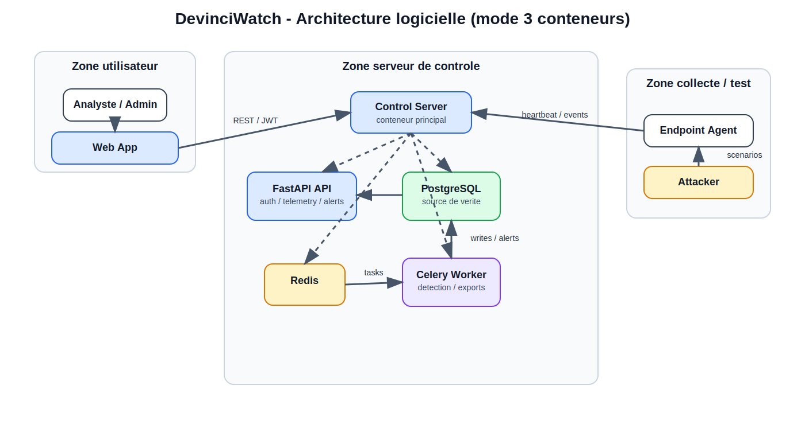
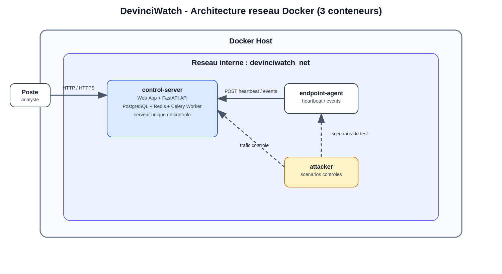
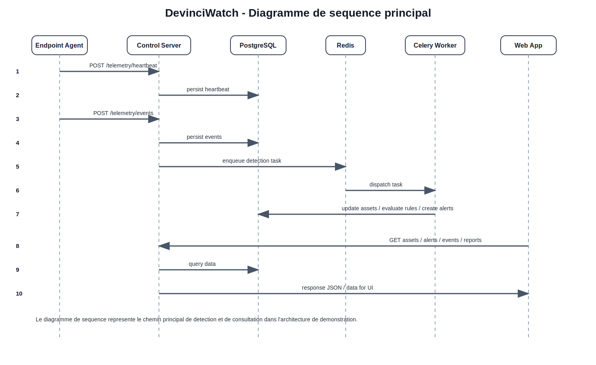

# Architecture definitive - DevinciWatch

## 1. Statut du document

Ce document fixe l'architecture de reference du produit DevinciWatch.

Sauf decision explicite ulterieure, cette architecture est consideree comme l'architecture definitive de depart pour le redeveloppement de l'application.

## 2. Objectif

Ce document définit l'architecture cible du produit DevinciWatch.

L'objectif est de concevoir une application de cybersurveillance réseau orientée SOC, capable de :

- recevoir de la télémétrie depuis un agent ;
- persister des événements et un inventaire d'actifs ;
- détecter des comportements suspects ;
- générer des alertes actionnables ;
- exposer une interface web d'analyse ;
- produire des exports et des éléments de preuve.

L'architecture doit rester :

- propre ;
- défendable en soutenance ;
- réaliste pour un MVP ;
- extensible pour les itérations suivantes.

## 3. Stack cible

### Backend

- Python
- FastAPI
- SQLAlchemy
- Pydantic
- Alembic

### Base de données

- PostgreSQL

### Traitements asynchrones

- Redis
- Celery

### Frontend

- application web consommant l'API FastAPI
- technologie frontend à confirmer au démarrage du développement

### Conteneurisation et démo

- Docker Compose
- topologie de demonstration en 3 conteneurs

### Topologie Docker retenue

- un conteneur `control-server`
- un conteneur `endpoint-agent`
- un conteneur `attacker`

## 4. Principes d'architecture

Les principes retenus sont les suivants :

- séparation claire entre collecte, traitement, stockage et présentation ;
- organisation par domaines fonctionnels ;
- logique métier centralisée côté backend ;
- traitements lourds ou différés sortis du chemin synchrone ;
- traçabilité native des actions sensibles ;
- structure adaptée à une démonstration rapide, mais suffisamment propre pour évoluer ;
- environnement de test reproductible via conteneurs séparés ;
- simulation contrôlée de comportements suspects sans embarquer de code destructeur réel.

## 5. Architecture logicielle



```text
[Endpoint Agent] -- heartbeat / events --> [Control Server]
[Web App] -------- REST / JWT --------> [Control Server]
[Control Server] - logique interne ---> [FastAPI API]
[Control Server] - logique interne ---> [PostgreSQL]
[Control Server] - logique interne ---> [Redis]
[Control Server] - logique interne ---> [Celery Worker]
[Celery Worker] ----------------------> [PostgreSQL]
```

## 6. Lecture de l'architecture logicielle

- l'utilisateur accede uniquement a l'application web ;
- l'application web consomme uniquement le serveur de controle ;
- l'agent envoie ses donnees uniquement au serveur de controle ;
- le simulateur de test ne parle pas directement a l'interface ;
- PostgreSQL, Redis et Celery restent logiquement separes, mais sont embarques dans le serveur de controle pour la demonstration.

## 7. Architecture reseau Docker



L'environnement de developpement et de demonstration est retenu sous la forme de trois conteneurs :

1. un conteneur serveur de controle ;
2. un conteneur endpoint agent ;
3. un conteneur attacker de simulation controlee.

Le conteneur `control-server` centralise l'application web, l'API FastAPI, PostgreSQL, Redis et le worker Celery pour simplifier le MVP et la soutenance.

```text
DOCKER HOST
  reseau interne : devinciwatch_net

  [Poste analyste]
         |
         | HTTP / HTTPS
         v
  [control-server]
         |
         +--> FastAPI API
         +--> PostgreSQL
         +--> Redis
         +--> Celery Worker

  [endpoint-agent] ----------------> [control-server]
         ^
         |
         | scenarios de test
         |
  [attacker]

  [attacker] -- trafic controle --> [endpoint-agent]
```

### Roles des conteneurs de test

#### `control-server`

Responsabilites :

- exposer l'application ;
- servir l'API ;
- servir eventuellement le frontend de demonstration ;
- centraliser les appels fonctionnels ;
- embarquer PostgreSQL, Redis et Celery pour la demonstration.

Composants internes embarques :

- FastAPI API ;
- PostgreSQL ;
- Redis ;
- Celery Worker ;
- frontend de demonstration si servi depuis le meme conteneur.

#### `endpoint-agent`

Responsabilites :

- jouer le role d'un hote supervise ;
- collecter ou simuler des evenements locaux ;
- remonter `heartbeat` et `events` vers `control-server`.

#### `attacker`

Responsabilites :

- produire des scenarios de test ;
- simuler des comportements suspects controles ;
- generer du trafic ou des evenements attendus pour la detection.

Contraintes :

- pas de charge destructive reelle ;
- pas de code malware reel ;
- scenarios strictement previsibles et demonstrables.

## 8. Diagramme de sequence principal



```text
1. Agent -> Control Server : POST /telemetry/heartbeat
2. Control Server -> PostgreSQL : persistence du heartbeat

3. Agent -> Control Server : POST /telemetry/events
4. Control Server -> PostgreSQL : persistence des evenements
5. Control Server -> Redis : mise en file d'une tache de detection
6. Redis -> Celery Worker : dispatch de la tache
7. Celery Worker -> PostgreSQL : mise a jour assets / evaluation des regles / creation des alertes

8. Web App -> Control Server : consultation assets / alerts / events / reports
9. Control Server -> PostgreSQL : lecture des donnees
10. Control Server -> Web App : reponse
```

## 9. Composants principaux

### 9.1 Agent de collecte

Rôle :

- collecter des `heartbeat` ;
- remonter des événements ;
- pousser les données vers l'API.

Contraintes :

- simple ;
- robuste ;
- peu couplé au reste du système.

### 9.2 API Backend FastAPI

Rôle :

- authentifier les utilisateurs ;
- recevoir les données agent ;
- exposer les endpoints métiers ;
- valider et normaliser les payloads ;
- piloter les règles métier ;
- retourner les données au frontend.

L'API constitue le point central du système et sera hebergee dans le conteneur `control-server`.

### 9.3 Base PostgreSQL

Rôle :

- stocker les utilisateurs ;
- stocker les actifs ;
- stocker les événements ;
- stocker les alertes ;
- stocker les journaux d'audit ;
- stocker les informations utiles aux exports et rapports.

PostgreSQL est la source de vérité fonctionnelle et sera embarquee dans `control-server` pour la phase MVP de demonstration.

### 9.4 Redis + Worker Celery

Rôle :

- sortir du chemin synchrone les traitements non immédiats ;
- exécuter les règles de détection ;
- recalculer certains indicateurs ;
- générer des exports ;
- préparer certains rapports ou tâches différées.

Redis et Celery seront egalement embarques dans `control-server` pour la phase MVP de demonstration.

### 9.5 Frontend web

Rôle :

- authentification ;
- visualisation du dashboard ;
- consultation des actifs ;
- consultation des événements ;
- consultation et traitement des alertes ;
- déclenchement d'exports.

Le frontend ne doit parler qu'à l'API.

### 9.6 Simulateur de test

Rôle :

- executer des scenarios de test de securite controles ;
- alimenter l'agent ou le serveur en comportements observables ;
- produire des preuves de detection pour la demonstration.

Ce composant existe pour le lab Docker de test, pas pour la production. Il sera heberge dans le conteneur `attacker`.

## 10. Découpage fonctionnel du backend

Le backend doit être organisé par domaines métier.

Modules recommandés :

- `auth`
- `telemetry`
- `assets`
- `alerts`
- `reports`
- `audit`
- `core`

### `auth`

Responsabilités :

- login ;
- génération et validation des tokens ;
- endpoint `/me` ;
- gestion des rôles.

### `telemetry`

Responsabilités :

- réception de `heartbeat` ;
- réception d'événements ;
- validation des payloads ;
- normalisation minimale avant persistance.

### `assets`

Responsabilités :

- création et mise à jour de l'inventaire ;
- enrichissement de base des actifs ;
- consultation des actifs par l'interface.

### `alerts`

Responsabilités :

- création d'alertes depuis les règles ;
- consultation ;
- détail ;
- traitement analyste ;
- cycle de vie des statuts.

### `reports`

Responsabilités :

- synthèse de KPI ;
- exports CSV ;
- vue exploitable pour la démonstration et la preuve.

### `audit`

Responsabilités :

- journalisation des actions sensibles ;
- conservation des traces ;
- consultation restreinte.

### `core`

Responsabilités :

- configuration ;
- sécurité transverse ;
- dépendances communes ;
- utilitaires partagés.

## 11. Structure logique FastAPI recommandée

Structure cible :

```text
app/
  main.py
  core/
  auth/
  telemetry/
  assets/
  alerts/
  reports/
  audit/
```

Chaque module devrait à terme contenir :

- routes FastAPI ;
- schémas Pydantic ;
- services métier ;
- accès aux données ;
- tests associés.

## 12. Flux de test en environnement Docker

Scenario de demonstration recommande :

1. `app-server`, `postgres`, `redis` et `worker` demarrent ;
2. `agent-container` s'enregistre et emet un `heartbeat` ;
3. `attack-simulator` declenche un scenario controle ;
4. l'agent observe ou produit les evenements attendus ;
5. l'API persiste les evenements ;
6. le worker evalue les regles ;
7. une ou plusieurs alertes sont generees ;
8. l'analyste visualise le resultat dans l'interface ;
9. un export ou un audit peut etre produit pour preuve.

## 13. Modèle de données fonctionnel

Entités principales à prévoir :

- `users`
- `roles`
- `assets`
- `events`
- `alerts`
- `audit_logs`
- `exports`

Relations principales :

- un événement peut être lié à un actif ;
- une alerte peut être liée à un actif et à un ou plusieurs événements ;
- une action utilisateur sensible doit produire une entrée d'audit.

## 14. Exigences non fonctionnelles

### Sécurité

- authentification obligatoire côté interface ;
- séparation des rôles `admin` / `analyst` ;
- protection des actions sensibles ;
- journalisation des opérations critiques.

### Qualité

- structure modulaire ;
- validation stricte des données d'entrée ;
- logique métier testable ;
- conventions homogènes.

### Observabilité

- endpoint de santé ;
- logs applicatifs structurés ;
- indicateurs simples pour la démonstration.

### Déploiement

- environnement local reproductible ;
- séparation nette entre configuration et code ;
- capacité à démontrer l'application en conditions réalistes ;
- possibilité de lancer un lab Docker complet avec serveur, agent et simulateur.

### Isolation du lab de test

- reseau Docker dedie ;
- aucun acces inutile hors du reseau de lab ;
- scenarios de test bornes et documentes.

## 15. MVP recommandé

Le premier incrément produit devrait couvrir :

1. authentification ;
2. ingestion `heartbeat` ;
3. ingestion `events` ;
4. persistance PostgreSQL ;
5. inventaire d'actifs simple ;
6. règles de détection minimales ;
7. liste et détail d'alertes ;
8. export CSV ;
9. audit minimal ;
10. lab Docker de demonstration en 3 conteneurs.

## 16. Architecture Docker retenue pour la demonstration

Architecture retenue de demonstration :

- `control-server`
- `endpoint-agent`
- `attacker`

Cette architecture est retenue comme architecture de test officielle du projet pour les phases de developpement, de demonstration et de validation fonctionnelle.

## 17. Pourquoi cette architecture est adaptée au sujet

Cette architecture est adaptée parce qu'elle :

- correspond directement aux attendus du kick-off ;
- est cohérente avec une implémentation Python/FastAPI ;
- sépare correctement les responsabilités ;
- permet une démonstration claire en soutenance ;
- reste assez simple pour un projet académique ;
- prepare une montée en qualité sans complexité excessive ;
- permet un environnement de test réaliste et reproductible ;
- rend visible toute la chaine detection -> alerte -> preuve.

## 18. Conclusion

L'architecture definitive retenue pour DevinciWatch est une architecture web modulaire centrée sur FastAPI, PostgreSQL, Redis et un worker asynchrone, avec un environnement Docker de test compose de trois conteneurs : `control-server`, `endpoint-agent` et `attacker`.

Elle est adaptee au sujet, defendable techniquement, exploitable pedagogiquement et suffisamment propre pour servir de base definitive au redeveloppement du produit.
