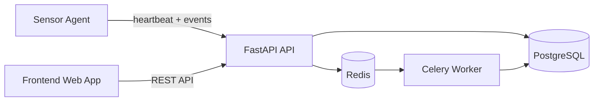
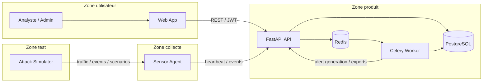
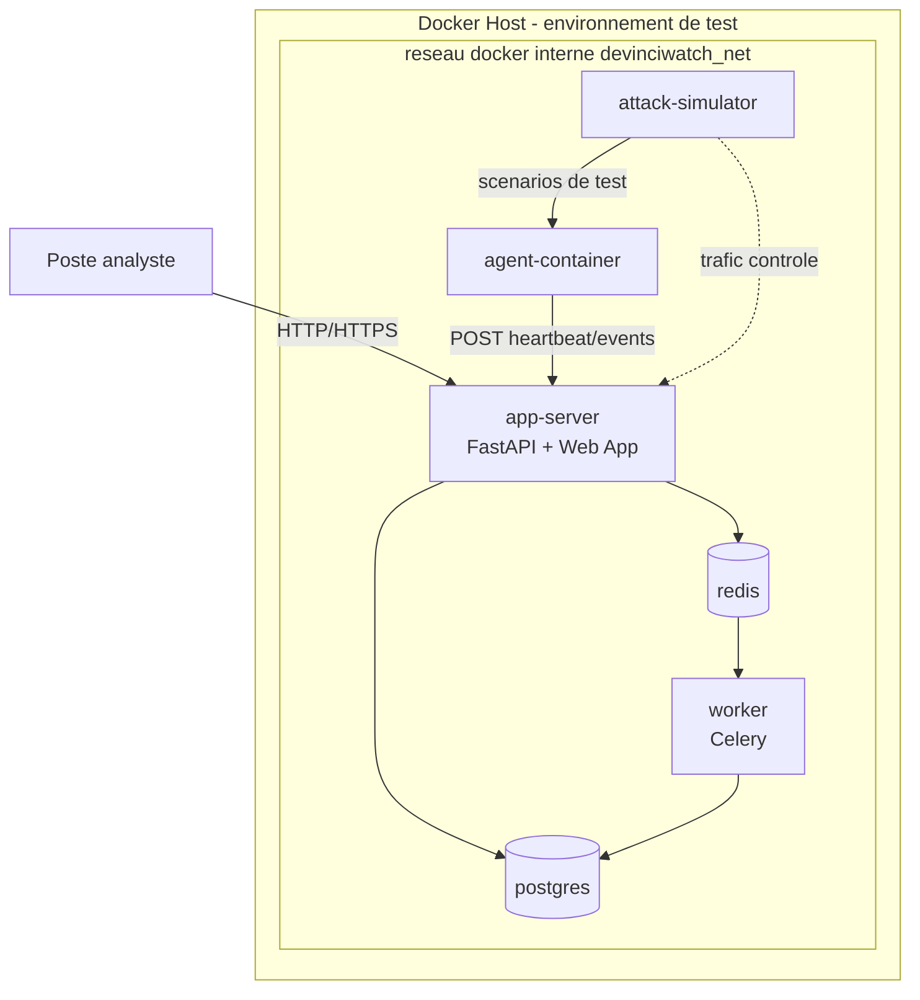
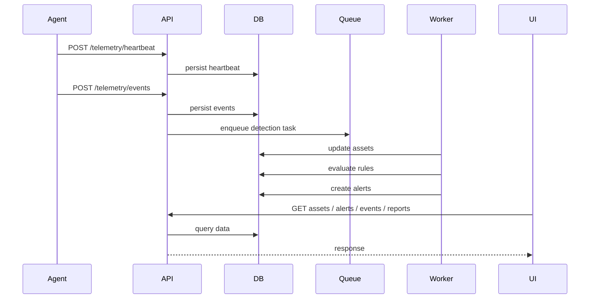

# Architecture definitive - DevinciWatch

## 1. Statut du document

Ce document fixe l'architecture de reference du produit DevinciWatch.

Sauf decision explicite ulterieure, cette architecture est consideree comme l'architecture definitive de depart pour le redeveloppement de l'application.

## 2. Objectif

Ce document définit l'architecture cible du produit DevinciWatch.

L'objectif est de concevoir une application de cybersurveillance réseau orientée SOC, capable de :

- recevoir de la télémétrie depuis un agent ;
- persister des événements et un inventaire d'actifs ;
- détecter des comportements suspects ;
- générer des alertes actionnables ;
- exposer une interface web d'analyse ;
- produire des exports et des éléments de preuve.

L'architecture doit rester :

- propre ;
- défendable en soutenance ;
- réaliste pour un MVP ;
- extensible pour les itérations suivantes.

## 3. Stack cible

### Backend

- Python
- FastAPI
- SQLAlchemy
- Pydantic
- Alembic

### Base de données

- PostgreSQL

### Traitements asynchrones

- Redis
- Celery

### Frontend

- application web consommant l'API FastAPI
- technologie frontend à confirmer au démarrage du développement

### Conteneurisation et démo

- Docker Compose

### Simulation de test

- un conteneur agent dedie
- un conteneur de simulation d'attaques controlees

## 4. Principes d'architecture

Les principes retenus sont les suivants :

- séparation claire entre collecte, traitement, stockage et présentation ;
- organisation par domaines fonctionnels ;
- logique métier centralisée côté backend ;
- traitements lourds ou différés sortis du chemin synchrone ;
- traçabilité native des actions sensibles ;
- structure adaptée à une démonstration rapide, mais suffisamment propre pour évoluer ;
- environnement de test reproductible via conteneurs séparés ;
- simulation contrôlée de comportements suspects sans embarquer de code destructeur réel.

## 5. Vue d'ensemble



## 6. Architecture technique complete



### Lecture de l'architecture technique

- l'utilisateur accede uniquement a l'application web ;
- l'application web consomme uniquement l'API FastAPI ;
- l'agent envoie ses donnees uniquement a l'API ;
- le simulateur de test ne parle pas directement a l'interface ;
- PostgreSQL porte la persistance metier ;
- Redis porte la file et la coordination asynchrone ;
- Celery execute les traitements differes, la detection et certains exports.

## 7. Architecture reseau de test Docker

L'environnement de developpement et de demonstration sera dockerise avec au minimum trois roles visibles :

1. un conteneur serveur applicatif ;
2. un conteneur agent ;
3. un conteneur de simulation de comportements malveillants controles.

L'application pourra etre decomposee en plusieurs services Docker, mais la topologie fonctionnelle de demonstration restera celle-ci.



### Roles des conteneurs de test

#### `app-server`

Responsabilites :

- exposer l'application ;
- servir l'API ;
- servir eventuellement le frontend de demonstration ;
- centraliser les appels fonctionnels.

#### `agent-container`

Responsabilites :

- jouer le role d'un hote supervise ;
- collecter ou simuler des evenements locaux ;
- remonter `heartbeat` et `events` vers `app-server`.

#### `attack-simulator`

Responsabilites :

- produire des scenarios de test ;
- simuler des comportements suspects controles ;
- generer du trafic ou des evenements attendus pour la detection.

Contraintes :

- pas de charge destructive reelle ;
- pas de code malware reel ;
- scenarios strictement previsibles et demonstrables.

#### `postgres`

Responsabilites :

- stocker les donnees metier du produit.

#### `redis`

Responsabilites :

- file de taches ;
- coordination des traitements asynchrones.

#### `worker`

Responsabilites :

- detection asynchrone ;
- enrichissement d'actifs ;
- exports et taches differees.

## 8. Composants principaux

### 8.1 Agent de collecte

Rôle :

- collecter des `heartbeat` ;
- remonter des événements ;
- pousser les données vers l'API.

Contraintes :

- simple ;
- robuste ;
- peu couplé au reste du système.

### 8.2 API Backend FastAPI

Rôle :

- authentifier les utilisateurs ;
- recevoir les données agent ;
- exposer les endpoints métiers ;
- valider et normaliser les payloads ;
- piloter les règles métier ;
- retourner les données au frontend.

L'API constitue le point central du système.

### 8.3 Base PostgreSQL

Rôle :

- stocker les utilisateurs ;
- stocker les actifs ;
- stocker les événements ;
- stocker les alertes ;
- stocker les journaux d'audit ;
- stocker les informations utiles aux exports et rapports.

PostgreSQL est la source de vérité fonctionnelle.

### 8.4 Redis + Worker Celery

Rôle :

- sortir du chemin synchrone les traitements non immédiats ;
- exécuter les règles de détection ;
- recalculer certains indicateurs ;
- générer des exports ;
- préparer certains rapports ou tâches différées.

### 8.5 Frontend web

Rôle :

- authentification ;
- visualisation du dashboard ;
- consultation des actifs ;
- consultation des événements ;
- consultation et traitement des alertes ;
- déclenchement d'exports.

Le frontend ne doit parler qu'à l'API.

### 8.6 Simulateur de test

Rôle :

- executer des scenarios de test de securite controles ;
- alimenter l'agent ou le serveur en comportements observables ;
- produire des preuves de detection pour la demonstration.

Ce composant existe pour le lab Docker de test, pas pour la production.

## 9. Découpage fonctionnel du backend

Le backend doit être organisé par domaines métier.

Modules recommandés :

- `auth`
- `telemetry`
- `assets`
- `alerts`
- `reports`
- `audit`
- `core`

### `auth`

Responsabilités :

- login ;
- génération et validation des tokens ;
- endpoint `/me` ;
- gestion des rôles.

### `telemetry`

Responsabilités :

- réception de `heartbeat` ;
- réception d'événements ;
- validation des payloads ;
- normalisation minimale avant persistance.

### `assets`

Responsabilités :

- création et mise à jour de l'inventaire ;
- enrichissement de base des actifs ;
- consultation des actifs par l'interface.

### `alerts`

Responsabilités :

- création d'alertes depuis les règles ;
- consultation ;
- détail ;
- traitement analyste ;
- cycle de vie des statuts.

### `reports`

Responsabilités :

- synthèse de KPI ;
- exports CSV ;
- vue exploitable pour la démonstration et la preuve.

### `audit`

Responsabilités :

- journalisation des actions sensibles ;
- conservation des traces ;
- consultation restreinte.

### `core`

Responsabilités :

- configuration ;
- sécurité transverse ;
- dépendances communes ;
- utilitaires partagés.

## 10. Structure logique FastAPI recommandée

Structure cible :

```text
app/
  main.py
  core/
  auth/
  telemetry/
  assets/
  alerts/
  reports/
  audit/
```

Chaque module devrait à terme contenir :

- routes FastAPI ;
- schémas Pydantic ;
- services métier ;
- accès aux données ;
- tests associés.

## 11. Flux principal de données



## 12. Flux de test en environnement Docker

Scenario de demonstration recommande :

1. `app-server`, `postgres`, `redis` et `worker` demarrent ;
2. `agent-container` s'enregistre et emet un `heartbeat` ;
3. `attack-simulator` declenche un scenario controle ;
4. l'agent observe ou produit les evenements attendus ;
5. l'API persiste les evenements ;
6. le worker evalue les regles ;
7. une ou plusieurs alertes sont generees ;
8. l'analyste visualise le resultat dans l'interface ;
9. un export ou un audit peut etre produit pour preuve.

## 13. Modèle de données fonctionnel

Entités principales à prévoir :

- `users`
- `roles`
- `assets`
- `events`
- `alerts`
- `audit_logs`
- `exports`

Relations principales :

- un événement peut être lié à un actif ;
- une alerte peut être liée à un actif et à un ou plusieurs événements ;
- une action utilisateur sensible doit produire une entrée d'audit.

## 14. Exigences non fonctionnelles

### Sécurité

- authentification obligatoire côté interface ;
- séparation des rôles `admin` / `analyst` ;
- protection des actions sensibles ;
- journalisation des opérations critiques.

### Qualité

- structure modulaire ;
- validation stricte des données d'entrée ;
- logique métier testable ;
- conventions homogènes.

### Observabilité

- endpoint de santé ;
- logs applicatifs structurés ;
- indicateurs simples pour la démonstration.

### Déploiement

- environnement local reproductible ;
- séparation nette entre configuration et code ;
- capacité à démontrer l'application en conditions réalistes ;
- possibilité de lancer un lab Docker complet avec serveur, agent et simulateur.

### Isolation du lab de test

- reseau Docker dedie ;
- aucun acces inutile hors du reseau de lab ;
- scenarios de test bornes et documentes.

## 15. MVP recommandé

Le premier incrément produit devrait couvrir :

1. authentification ;
2. ingestion `heartbeat` ;
3. ingestion `events` ;
4. persistance PostgreSQL ;
5. inventaire d'actifs simple ;
6. règles de détection minimales ;
7. liste et détail d'alertes ;
8. export CSV ;
9. audit minimal ;
10. lab Docker de demonstration avec agent et simulateur.

## 16. Architecture Docker retenue pour la demonstration

Architecture retenue de demonstration :

- `app-server`
- `postgres`
- `redis`
- `worker`
- `agent-container`
- `attack-simulator`

Cette architecture est retenue comme architecture de test officielle du projet pour les phases de developpement, de demonstration et de validation fonctionnelle.

## 17. Pourquoi cette architecture est adaptée au sujet

Cette architecture est adaptée parce qu'elle :

- correspond directement aux attendus du kick-off ;
- est cohérente avec une implémentation Python/FastAPI ;
- sépare correctement les responsabilités ;
- permet une démonstration claire en soutenance ;
- reste assez simple pour un projet académique ;
- prepare une montée en qualité sans complexité excessive ;
- permet un environnement de test réaliste et reproductible ;
- rend visible toute la chaine detection -> alerte -> preuve.

## 18. Conclusion

L'architecture definitive retenue pour DevinciWatch est une architecture web modulaire centrée sur FastAPI, PostgreSQL, Redis et un worker asynchrone, avec un environnement Docker de test compose d'un serveur applicatif, d'un agent et d'un simulateur de scenarios suspects controles.

Elle est adaptee au sujet, defendable techniquement, exploitable pedagogiquement et suffisamment propre pour servir de base definitive au redeveloppement du produit.
